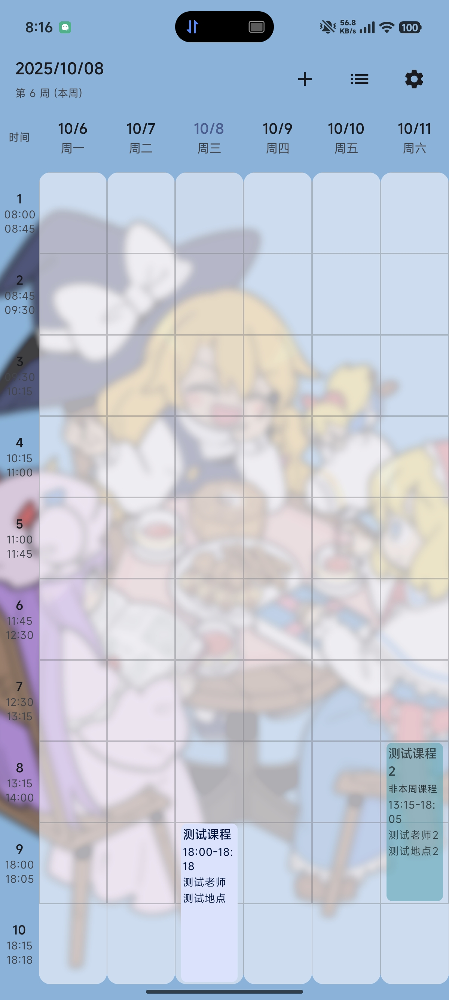
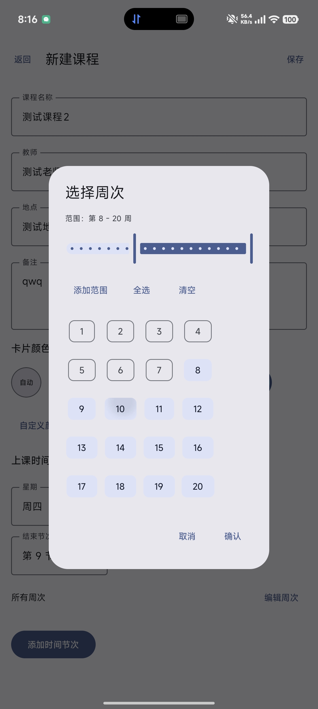
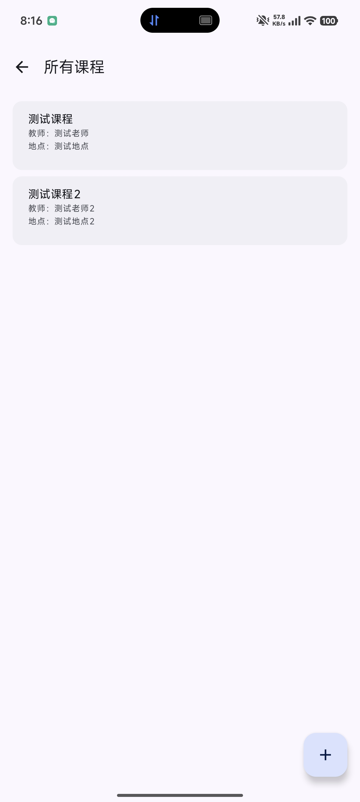
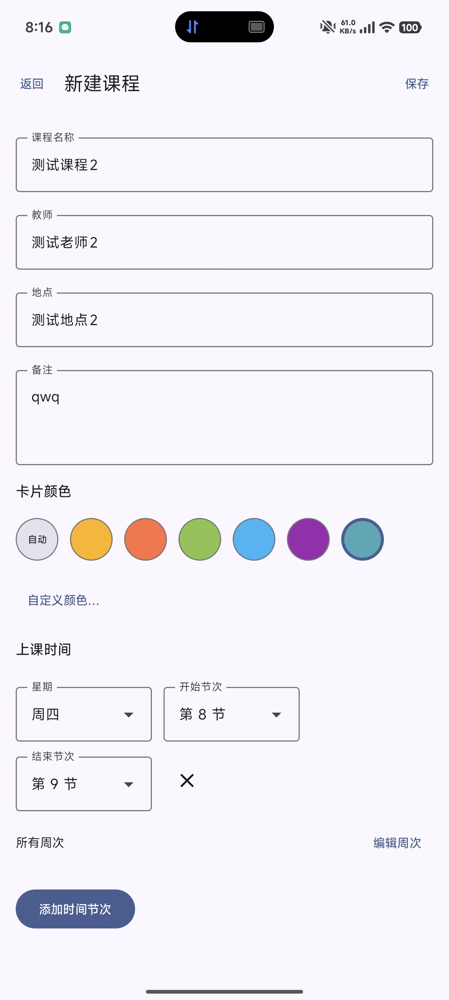
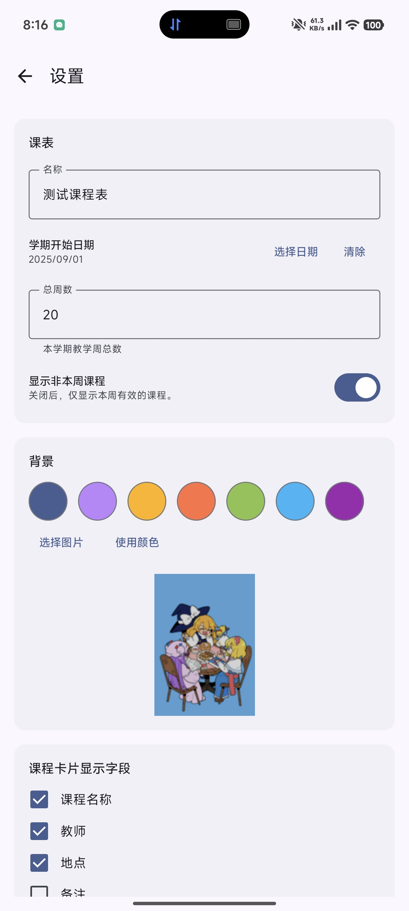
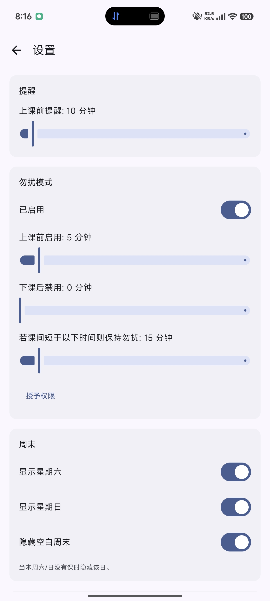

# kiraraschedule

一个自用的m3样式设计的课程表app

支持自定义时间提前通知课程、自定义时间提前打开免打扰及自动关闭免打扰

其他功能正在绝赞开发中...

## 与其他的课程表app有何区别？
1. 尽可能将所有设置都交给用户，比如提前n分钟进行课程通知，提前n分钟开启勿扰模式及自动关闭
2. 尽量给用户良好体验
3. 进行开源
4. 无除相册权限(使用图片背景)外其他隐私权限，所有数据处理均在本地，无需联网
5. 原生kt优化速度

## 权限列表
1. 显示通知 (推送课程消息)
2. 勿扰模式使用权限 (自动打开/关闭勿扰模式)
3. 开机启动 (防止推送/自动打开/关闭勿扰模式失败)
4. 防止手机休眠 (防止推送/自动打开/关闭勿扰模式失败)
5. 运行前台服务 (防止推送/自动打开/关闭勿扰模式失败)

## 相关截图

### 主界面

### 课程编辑

### 课程列表

### 设置界面

